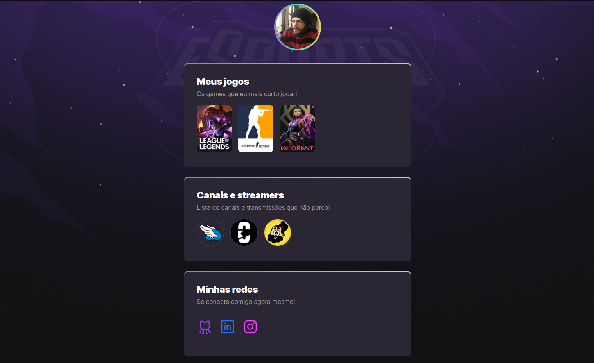
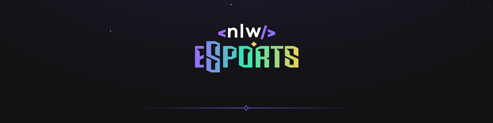

# NLW eSports 

>Trilha Explorer

## 🎮 Projeto 
___

Projeto construído no evento Next Level Week (NLW) da Rocketseat. Modelo de Linktree que reúne informações de usuários gamers como Jogos, canais e streamers favoritos e redes sociais. Serviu para praticar técnicas de Animações CSS e design responsivo.

[🔗 Clique aqui para acessar](https://marcelo5g.github.io/nlw-eSports-Explorer/)

 

## 🛠️ Tecnologias
___

    - HTML
    - CSS
    - Git e Github

## 📫 Contato 
___

 

___

